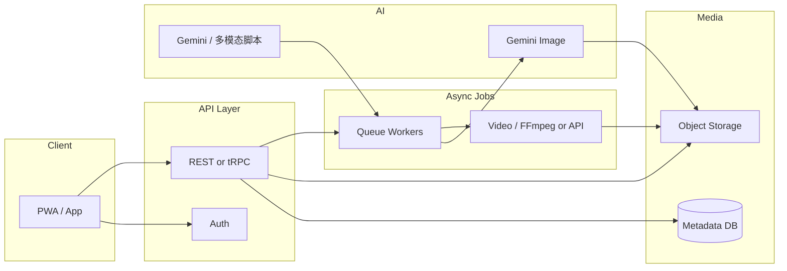

# Trip Media Platform — Vision & Architecture（规划稿）

> 目标：旅行中**每天轻松加照片** → **一键 Gemini 修图** → **把修好的图交给用户** → **行程结束自动生成 VLOG**。  
> 本文是 **Jobs（体验）+ VC（可扩张）** 对齐的框架说明；实现以 `platform/` 目录为起点演进。

---

## 1. 产品故事（一句话）

**「同一天的照片，不丢、不乱、当晚就能出片；旅程收尾时，一条片子自动讲完故事。」**

---

## 2. Jobs 标准：三条主路径，勿混

| 时刻       | 用户只做一件事     | 系统负责                     |
|------------|--------------------|------------------------------|
| 旅途中每天 | 「选图 → 上传」    | 归类到当天、可选一键修图     |
| 任意时刻   | 「看修图结果」     | 版本对比、下载、分享         |
| 行程结束后 | 「一键生成 VLOG」 | 拉时间线、模板、渲染、通知   |

不要在「加照片」屏塞 VLOG 选项；结束行程后再出现主 CTA。

---

## 3. VC 标准：要回答的四个问题

1. **为什么是你**：行程结构 + 修图 + 成片 的一体化，比「相册 + 剪映」少三步。  
2. **成本结构**：Gemini 按 token/张计费、对象存储、视频编码算力 —— 需在 MVP 就做 **每用户每日成本上限**。  
3. **护城河**：**时间线 + 权限 + 成片风格** 可沉淀为模板与用户偏好，而不是单次 API 调用。  
4. **分发**：分享链接 / 小程序 / App —— 静态 `index.html` 可继续作为 **「只读行程展示」**，重操作走 App 或 Web App。

---

## 4. 高层架构（推荐演进顺序）

- **MVP**：Web App（Next.js）+ **Vercel Blob / S3** + **Postgres** + **Server Actions 或 Route Handler** 调 Gemini + 简单队列（Vercel Workflow / Inngest / QStash）。  
- **VLOG**：先 **「图 + 字幕 + BGM + Ken Burns」**（FFmpeg 模板），再考虑 **生成式视频 API**（成本与版权单独评估）。

---

## 5. 与当前仓库的关系

| 现有资产           | 未来角色                         |
|--------------------|----------------------------------|
| `index.html` 行程 | 只读展示、深链到某天、或嵌入 WebView |
| `trip.js`         | 可逐步迁出为「行程 JSON」数据源   |
| `platform/`       | **新后端 / 类型 / 契约** 的唯一入口 |

---

## 6. 里程碑（建议）

| Phase | 交付物 |
|-------|--------|
| P0    | 类型 + API 契约（本仓库 `platform/`） |
| P1    | 登录 + 创建 Trip + 按天上传原图 |
| P2    | 异步「一键修图」Gemini + 结果版本管理 |
| P3    | 通知（邮件/Web Push）修图完成 |
| P4    | 结束行程 → 任务「生成 VLOG」→ 下载/分享链接 |
| P5    | 成本监控、滥用防护、多 Trip 模板 |

---

## 7. 风险清单（实现前必读）

- 用户照片：**隐私、删除权、未成年人、敏感内容** —— 产品条款 + 审核策略。  
- Gemini：**提示词与输出版权**、地区 API 可用性。  
- VLOG BGM：**版权音乐** —— 只用免版税曲库或用户自带。

---

## 8. 下一步（你拍板后）

在 `platform/` 里选栈（例如 Next.js + Prisma + Vercel Blob），从 **P1 上传 API** 写第一个可部署 PR；本文件只做规划锚点，随决策迭代版本号。

**Doc version:** 0.1.0
